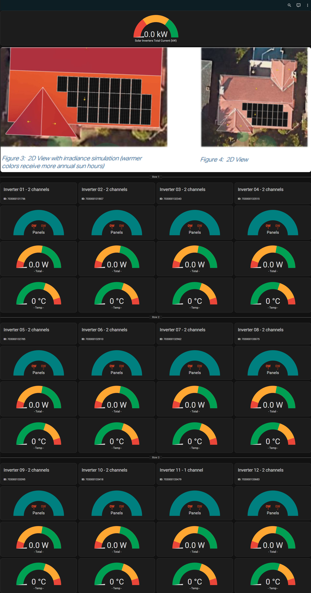

1. Git clone this into > your homeassistant folder ~/config/www/images  (you may have to make the images folder)
2. instructions are at the top of c_solar.yaml in the config folder of this folder

https://user-images.githubusercontent.com/128875345/231960669-f5743440-0650-4fc2-bd8a-47dfaa54c0ba.mp4

[]

